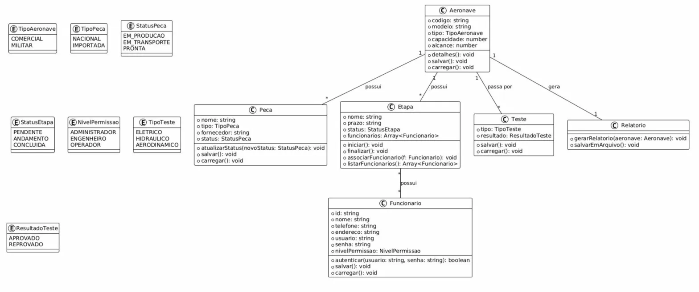

# ✈️ Aerocode — Sistema de Gestão de Produção de Aeronaves

Sistema CLI desenvolvido em **TypeScript** para gerenciar o processo de produção de aeronaves, desde o cadastro inicial até a entrega final ao cliente.

Projeto desenvolvido como atividade avaliativa da disciplina de Programação Orientada a Objetos, sob orientação do Prof. Dr. Gerson Penha.

---

## 📋 Funcionalidades

- Cadastro e consulta de aeronaves (com código único)
- Gerenciamento de peças associadas a cada aeronave
- Controle de etapas de produção com ordem lógica obrigatória
- Registro de testes (elétrico, hidráulico e aerodinâmico)
- Cadastro de funcionários com autenticação e níveis de permissão
- Geração de relatório final em arquivo `.txt`
- Persistência de dados em arquivos JSON

---

## 🗂️ Estrutura do Projeto

```
aerocode/
├── src/
│   ├── enums/  # Enumerações do sistema
│   │   ├──   NivelPermissao.ts   
│   │   ├──   ResultadoTeste.ts       
│   │   ├──   StatusEtapa.ts  
│   │   ├──   StatusPeca.ts  
│   │   ├──   TipoAeronave.ts  
│   │   ├──   TipoPeca.ts  
│   │   └──   TipoTeste.ts  
│   │
│   ├── Aeronave.ts       # Classe Aeronave
│   ├── Peca.ts           # Classe Peca
│   ├── Etapa.ts          # Classe Etapa
│   ├── Teste.ts          # Classe Teste
│   ├── Funcionario.ts    # Classe Funcionario
│   ├── Relatorio.ts      # Classe Relatorio
│   └── main.ts          # CLI principal (menus e navegação)
├── data/                 # Gerado automaticamente (JSON)
├── relatorios/           # Gerado automaticamente (relatórios .txt)
├── docs/                 # Documentação do projeto
├── package.json
└── tsconfig.json
```

---

## ⚙️ Requisitos

- Node.js v18 ou superior
- npm v9 ou superior
- TypeScript v5 (instalado via npm)

Compatível com **Windows 10+**, **Ubuntu 24.04+** e distribuições derivadas.

---

## 🚀 Como executar

**1. Clone o repositório:**
```bash
git clone https://github.com/gustav0-gg/AV1-POO.git
cd aerocode
```

**2. Instale as dependências:**
```bash
npm install
```

**3. Compile e execute:**
```bash
npm run build
npm start
```

---

## 🔐 Primeiro Acesso

No primeiro uso, o sistema cria automaticamente um usuário administrador padrão:

| Campo  | Valor     |
|--------|-----------|
| Login  | `admin`   |
| Senha  | `admin123`|

> ⚠️ Recomenda-se cadastrar um novo administrador e remover o usuário padrão após o primeiro acesso.

---

## 👥 Níveis de Permissão

| Nível           | Permissões                                              |
|-----------------|---------------------------------------------------------|
| ADMINISTRADOR   | Acesso total, incluindo cadastro de funcionários        |
| ENGENHEIRO      | Cadastro de aeronaves, peças, etapas, testes e relatórios |
| OPERADOR        | Atualização de status de peças e início de etapas       |

---

## 🧱 Diagrama de Classes

O sistema foi implementado seguindo o diagrama UML abaixo:



---

## 📦 Scripts disponíveis

| Comando         | Descrição                              |
|-----------------|----------------------------------------|
| `npm run build` | Compila o TypeScript para `dist/`      |
| `npm start`     | Executa o projeto compilado            |

---

## 🛠️ Tecnologias

- [TypeScript](https://www.typescriptlang.org/)
- [Node.js](https://nodejs.org/)
- Módulos nativos: `fs`, `path`, `readline`